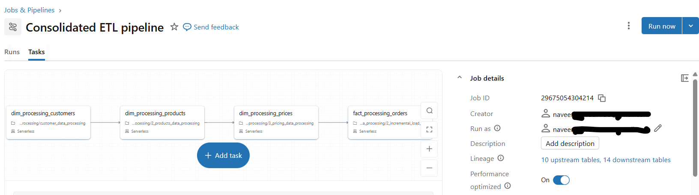

# fmcg-sales-data-pipeline-databricks
End-to-end ETL pipeline built on Databricks using Medallion Architecture to process, transform, and unify REX sales data for BI analytics

# Databricks ETL Pipeline for Sales Analytics

## 🚀 Overview

This project showcases an **end-to-end ETL pipeline built on Databricks** using **Medallion Architecture (Bronze → Silver → Gold)**.

The pipeline processes raw sales data from cloud storage, transforms it into structured datasets, and delivers **BI-ready tables** to support sales and performance analytics.

---

## 🏗️ Architecture

The pipeline follows a simple and scalable **Medallion Architecture**:

* **Bronze** → Raw data ingestion from AWS S3 with metadata
* **Silver** → Data cleaning, validation, and transformation
* **Gold** → Business-ready fact and dimension tables

---

## 🔄 End-to-End Data Pipeline Flow

```text
AWS S3 (Raw Data)
   ↓
Bronze Layer (Raw Delta Tables)
   ↓
Silver Layer (Cleaned & Enriched Data)
   ↓
Gold Layer (Fact & Dimension Tables)
   ↓
BI Dashboard (Insights & Reporting)
```

---

* Supports both **full load** and **incremental processing**
* Uses **Delta Lake merge** for efficient updates
* Processes only impacted data during incremental runs

---

## 📊 Data Model

### Fact Table

* **fact_orders**

  * order_id
  * date
  * product_code
  * customer_code
  * sold_quantity

### Dimension Tables

* **dim_products**
* **dim_customers**
* **dim_gross_price**
* **dim_date**

The model follows a **star schema**, optimized for analytics and reporting.


---

## ⚙️ Key Features

* Built using **Databricks + PySpark + Delta Lake**
* Implemented **Medallion Architecture**
* Designed **scalable star schema**
* Developed **incremental ETL pipeline**
* Applied **data cleaning and standardization**
* Enabled **BI-ready data modeling**

---

## 🧠 Data Transformations

* Deduplication using business keys
* Handling invalid IDs and missing values
* Standardizing categories and text fields
* Parsing multiple date formats
* Aggregating daily data into monthly insights
* Enriching data using joins across datasets

---

## 📈 Dashboard Insights

The pipeline powers a BI dashboard that provides key business insights.

According to the dashboard (*REX BI 360 – page 1*): 

* **Total Revenue:** 119.93B
* **Total Quantity Sold:** 39.05M
* **Unique Customers:** 53
* **Average Selling Price:** 4052.46

### Key Visual Insights

* Monthly revenue trend across 2024–2025
* Top products by revenue
* Revenue distribution by channel (Retail, Direct, Acquisition)
* Top customers by quantity and revenue
* Product price vs quantity analysis

These insights enable better decision-making for **sales strategy and performance tracking**.

---

## 🛠️ Technologies Used

* Databricks
* Apache Spark (PySpark)
* Delta Lake
* AWS S3
* SQL
* BI Dashboard (Databricks SQL / Tableau / Power BI)

---

## 📂 Repository Structure

```text
notebooks/
├── 00_setup/
├── 01_dimension_processing/
├── 02_fact_processing/
├── 03_gold_modelling/

dashboard/
├── screenshots/
```

---

## 🌟 Highlights

* Built a **production-style ETL pipeline**
* Designed for **scalability and performance**
* Developed **BI dashboard** for Sales performance Overview
* Supports **incremental data processing**
* Converts raw data into **actionable insights**

---


